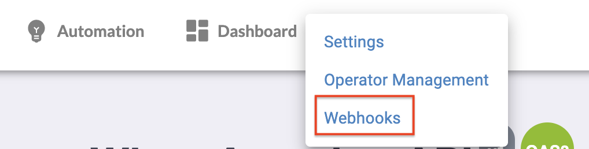
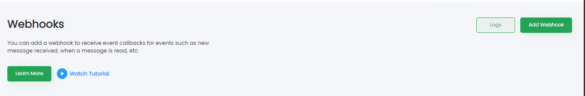
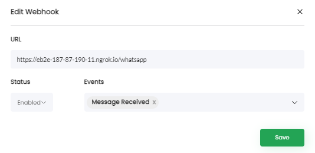
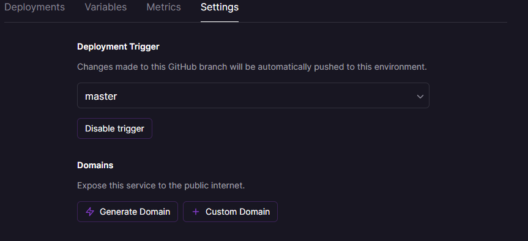

After obtaining the API Keys, Check out the  [WATI API Reference](https://docs.wati.io/reference/post_api-v1-addcontact-whatsappnumber) and play around with the APIs to get a sense of the basics.

Postman Collection: https://github.com/ClareAI/wati-postman-collection

# Configuring webhooks. 
* Webhooks are used to alert you on an incoming message via a callback URL.
It will used to capture our keywords that triggers the flow.

  ### **How to set the callback URL?**
1. From the WATi dashboard, click on **Webhooks**

2. Click on Add Webhooks

3. Add your server url. 

    There are two ways to add webhook server URLs.

    **3.1 For testing locally**
    
      a. Download [ngrok](https://ngrok.com/download)
  
      b. Start ngrok.exe and execute the following command:

      ```sh
      ngrok.exe http 8000
      ```
    c. Copy the https link and replace it as the URL.
  
    
    **3.2 For remote testing**
    
      a. Create a github repository for the bot.
  
    b. Sign up or login to your [railway.app](https://railway.app/) account
 
    c. Create a new project and select *Deploy from GitHub repo* > &emsp;&emsp; *Configure Github app* and link your bot github repository. 

    d. Click on Deploy Now.

    e. After successfully deploying your project, Click on the newly created Service Environment > go to *Settings*, under Domains heading click on _Generate Domain_.
  
    
  f. Copy the URL and paste it in WATI webhook settings. 

4. Set Status as **Enable** and set Event as **Message Received**

5. When a message is received, a callback happens on your webhook URL with the a payload

*For more information: [WATI Webhook](https://docs.wati.io/reference/webhooks)*
